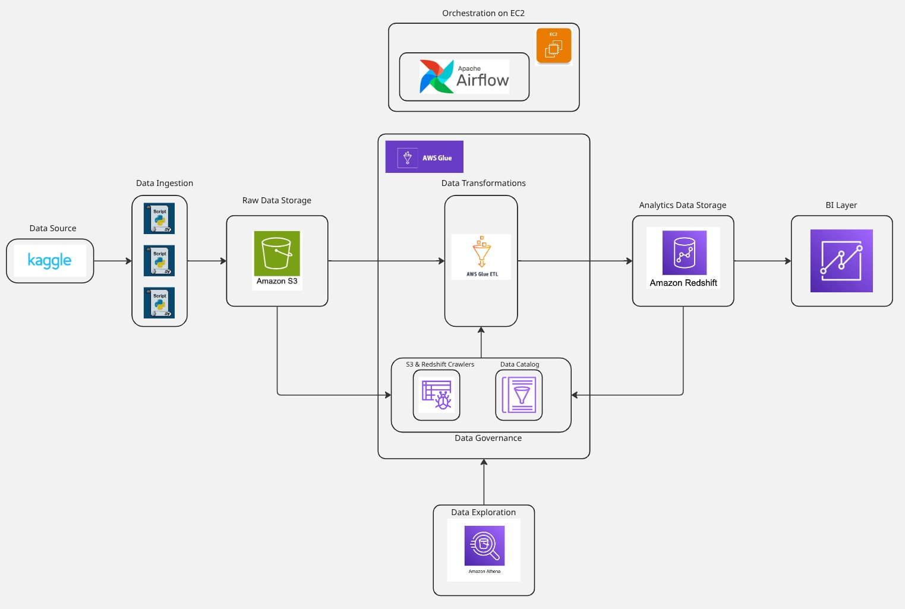
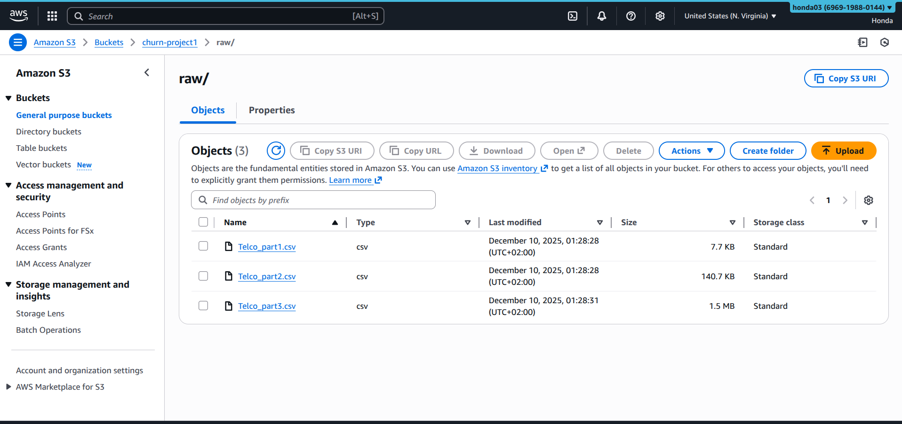
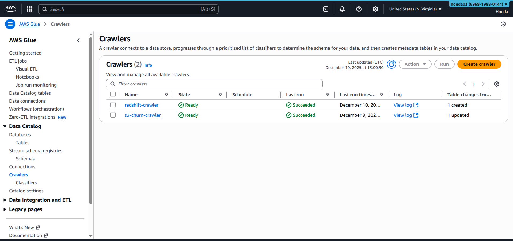
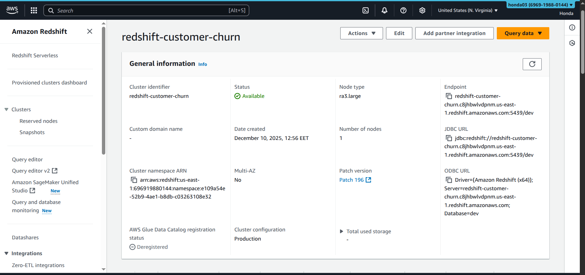
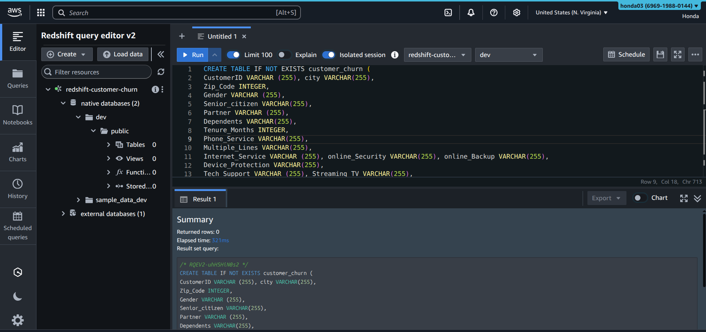
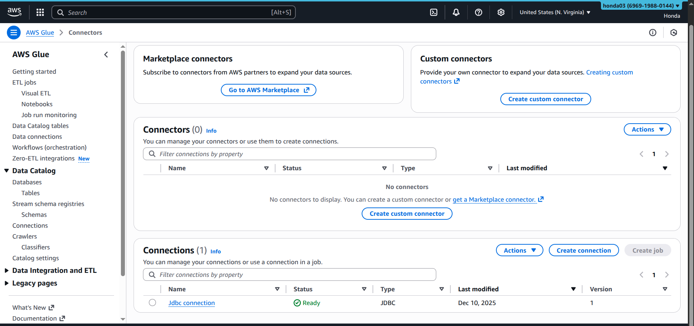
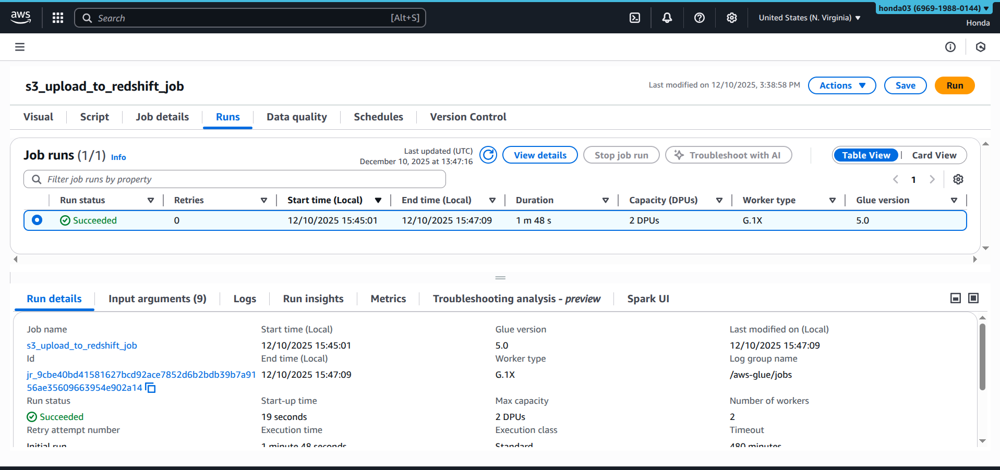
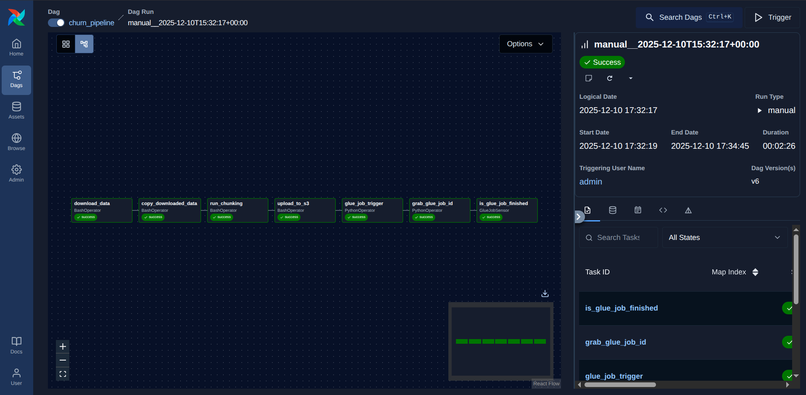

# 📞 Churn Customer Project — End-to-End Data Engineering Pipeline (Kaggle → S3 → Athena → Glue → Redshift → Airflow)

<div align="center">
  
[](https://www.python.org/)
[](https://aws.amazon.com/ec2/)
[](https://aws.amazon.com/s3/)
[](https://aws.amazon.com/glue/)
[](https://aws.amazon.com/athena/)
[](https://aws.amazon.com/redshift/)
[](https://airflow.apache.org/)

</div>

---

## 🏗️ Architecture 🔥



---

<div align="center">

**🔥 Churn analytics pipeline built from Kaggle dataset with full cloud ingestion, cataloging, transformation, and warehouse loading 🔥**
*🚀 From raw Excel → curated Redshift table with governance (Glue Catalog) and orchestration (Airflow) 🌟*

</div>

---

## 🏁 Getting Started (What you do first)

### 1) Clone / open the repo and prepare the runtime

* Work from the project root (the folder that contains the python/ and airflow/ directories).
* Use the provided project layout (see Project Structure below) so the Airflow DAG and scripts resolve their paths consistently.

### 2) Create and activate a Python virtual environment (recommended)

* Create: python3 -m venv venv
* Activate (Linux/macOS): source venv/bin/activate

### 3) Install dependencies

* Install with: pip install -r requirements.txt

### 4) Runtime note (how this project was executed)

* Airflow was deployed on an EC2 instance: t2.medium (Ubuntu) with 8 GB EBS storage.
* AWS region used in the pipeline configuration is us-east-1 (Glue job execution and related AWS resources).

---

## 📦 Requirements (what the project depends on)

The provided requirements.txt contains the runtime libraries used across the pipeline: kagglehub, openpyxl, apache-airflow, apache-airflow-providers-amazon, and boto3.

---

## 📁 Project Structure (what lives where)

```
project_root/
│
├── python/                       # Data ingestion + staging scripts (executed by Airflow tasks)
│   ├── data_downloading.py       # Download dataset (Kaggle -> local cache)
│   ├── data_chunks.py            # Split one Excel file into multiple parts (multi-file crawl simulation)
│   └── upload_chunks.py          # Convert Excel chunks to CSV and upload to S3 (Athena-friendly)
│
├── data/                         # Local staging area (Excel sources + generated CSVs)
│
├── images/                       # Screenshots and evidence used in this documentation
│
└── airflow/
    └── dags/
        └── churn_dag.py          # Airflow DAG orchestrating the full pipeline
```

---

## 🧠 The core idea (what this project demonstrates)

This project turns a single public churn dataset into a **production-like cloud analytics pipeline** by exercising four real-world capabilities:

1. **Source ingestion** (Kaggle → local staging) using a reproducible download mechanism (KaggleHub).
2. **Multi-file ingestion simulation** (one dataset becomes multiple physical files) to emulate real crawlers that must handle many objects.
3. **Data lake + catalog layer** (S3 raw landing zone + Glue Data Catalog) so the data is discoverable and queryable with Athena.
4. **Warehouse loading and governance** (Glue ETL writes curated columns/types into Redshift; Glue Catalog also covers the Redshift side via a Redshift crawler).

---

## 📊 End-to-end Data Flow (what happens, step by step)

1. **Download (source acquisition):** the Telco churn dataset is downloaded from Kaggle using KaggleHub into the Kaggle-managed cache (`~/.cache`).
2. **Stage (local project data folder):** the cached dataset is copied into the project’s `data/` directory (this is the handoff that Airflow automates inside the DAG).
3. **Simulate multi-source crawling:** the single Excel file is split into three smaller Excel files (three “files” = three upstream objects).
4. **Landing to S3 (raw zone):** each part is converted from XLSX to CSV and uploaded into `s3://churn-project1/raw/` (Athena-friendly format).
5. **Discovery & metadata:** a Glue Crawler scans the S3 raw prefix and creates/updates Glue Data Catalog tables (so Athena can query the data).
6. **Warehouse layer:** a private Redshift cluster is created; a Redshift table is defined for the curated churn dataset.
7. **Glue ETL (S3 → Redshift):** a Glue job reads from S3 (catalog tables), applies schema/column selection and type adjustments, and writes into Redshift.
8. **Orchestration & validation:** an Airflow DAG runs the full sequence and ends with an explicit success-check (Glue job completion).

---

## 🔎 Data Source: Kaggle (Telco Customer Churn)

### Dataset

* Source: Kaggle dataset “yeanzc/telco-customer-churn-ibm-dataset”.
* Download mechanism: KaggleHub (latest version download).

### Why this choice is strong

* It gives a real business problem (customer churn) with mixed numeric/categorical features and an obvious analytics objective (predict/understand churn).
* The download is reproducible and can be embedded into an orchestrated pipeline (Airflow) without manual steps.

---

## 🧱 Multi-file ingestion simulation (why splitting matters)

### What you implemented

* The original Excel file is split into three Excel files (Part 1, Part 2, Part 3).

### What this simulates

* Real ingestion rarely arrives as “one perfect file”. Production pipelines must handle multiple objects, file-level schema consistency, and file naming conventions.

---

## ☁️ Landing zone: S3 raw + Athena query capability

### S3 raw layout

* Target bucket: churn-project1
* Target prefix: raw/
* File format: CSV (converted from XLSX to CSV in churn_dag.py specifically to be readable by Athena)

### Athena validation (what this step proves)

* After upload, Athena can query the raw churn data using the Glue Data Catalog table definitions generated by the S3 crawler.



---

## 🧭 Glue Crawlers + Data Catalog (governance and discovery)

Built two crawlers (two “discovery surfaces”), which is a strong production pattern:

1. **S3 Crawler (raw lake discovery)**

* Scans the S3 raw prefix and creates/updates Glue Catalog tables for the uploaded CSV chunks.

2. **Redshift Crawler (warehouse discovery)**

* Connects to the Redshift database and registers the warehouse objects (schemas/tables) into the Glue Data Catalog.



---

## 🏢 Redshift: cluster + table (the analytics layer)

### What was created

* A Redshift cluster (private) hosting a database/schema for the churn dataset.
* A Redshift table created (and verified) using the Redshift editor.




---

## 🔌 The critical networking lesson: Glue ↔ private Redshift (JDBC connection fix)

### The issue I hit

* Glue’s automatic network selection (default subnet/security group) could not reach the private Redshift endpoint, producing timeouts/network errors.

### The fix I implemented (You may do another method)

* Chose JDBC connection not redshift connection and forced Glue to run inside the same VPC context as Redshift.
* Selected:

  * the same VPC as the Redshift cluster,
  * a subnet with correct routing to the Redshift private address space,
  * a security group that Redshift allows (proper inbound rules).

### The exact JDBC endpoint (what I used)

* jdbc:redshift://redshift-customer-churn.c8jhbwlvdpnm.us-east-1.redshift.amazonaws.com:5439/dev

### Why this is an important takeaway

* For private Redshift clusters, “Glue must be network-reachable” is not optional—without matching VPC/subnet/SG, ETL jobs can fail even when credentials and SQL are correct.



---

## 🧪 Glue ETL: S3 (raw) → Redshift (curated)

### What the Glue job does (the transformation contract)

* **Source:** S3 raw CSV objects (discovered via Glue Catalog).
* **Transformations performed:**

  * selecting only the required columns for the churn use case,
  * applying schema/type corrections (ensuring Redshift receives correct data types),
  * producing a clean, analytics-ready table layout.
* **Destination:** Redshift target table.




---

## 🧷 Orchestration (Airflow on EC2): the pipeline conductor

### Environment (where Airflow runs)

* Airflow executed on an EC2 Ubuntu instance (t2.medium) with 8GB EBS.

### What the DAG orchestrates (in strict order)

1. Download dataset from Kaggle (KaggleHub)
2. Copy the latest cached Kaggle version into the project’s data/ folder
3. Split the Excel file into three parts (multi-file ingestion simulation)
4. Convert each part to CSV and upload to S3 (raw/ prefix)
5. Trigger the Glue ETL job (S3 → Redshift)
6. Retrieve the Glue job run id.
7. Check if the glue job is successful through poking every 60 seconds.



### Why the DAG is a strong design choice

* It converts what could be a manual sequence into an auditable workflow with defined dependencies and a final “job success” check (GlueJobSensor).

---


## 🚀 Key Achievements (what this project proves)

* End-to-end data pipeline: Kaggle → S3 (raw) → Athena (exploration) → Glue ETL → Redshift (analytics)
* Automated orchestration using Airflow (EC2-hosted) with a clear success/failure gate
* Production-relevant metadata management via Glue Data Catalog (S3 + Redshift crawlers)
* Practical AWS networking mastery (Glue in the correct VPC/subnet/SG for private Redshift access)

---

## 🙏 Credits

This project is built on the workflow concept originally demonstrated by **tuplespectra** (video reference: [https://www.youtube.com/watch?v=jCn1UuVf_PY&t=638s](https://www.youtube.com/watch?v=jCn1UuVf_PY&t=638s)). This version elevates it by automating the full pipeline with **Airflow** (from download through S3 landing to Glue ETL execution and verification).
